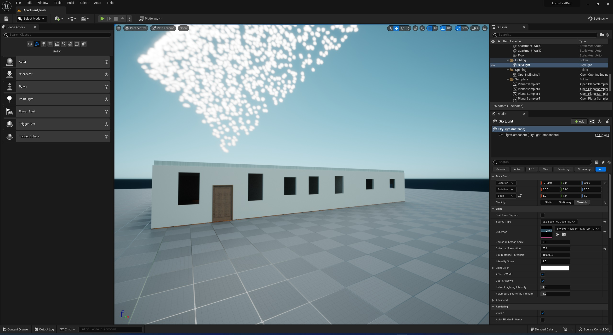

# Opening Design using Bayesian Optimization

## Overview
Opening Design using Bayesian Optimization

This repository contains the source code that is part of the supplemental material for the *[Paper: Opening Design using Bayesian Optimization](https://www.sciencedirect.com/science/article/pii/S2096579623000256?via%3Dihub)* that was presented in CGI 2023. The contents are:

- Source code
- Unreal Engine project file
- 3rd Party pre-compiled libraries
- Test scenes

Some additional quick links
- [Author version](https://lotus.aueb.gr/content/CGI2023%20-%20Opening%20Design%20using%20Bayesian%20Optimization_preprint.pdf) of the paper
- [Project page](https://lotus.aueb.gr/)

The method and system were developed on Unreal Engine 5

### Table of Contents

- [Overview](#Overview)
- [Usage Instructions](#Usage-Instructions)
- [How to Cite](#How-to-Cite)
- [Acknowledgments](#Acknowledgments)

## Acknowledgments
The provided porject files and implementation has been tested in Unreal Engine 5.0

## How to Cite

<blockquote>
<pre style="white-space:pre-wrap;">
@article{VITSAS2023550,
title = {Opening Design using Bayesian Optimization},
journal = {Virtual Reality & Intelligent Hardware},
volume = {5},
number = {6},
pages = {550-564},
year = {2023},
issn = {2096-5796},
doi = {https://doi.org/10.1016/j.vrih.2023.06.001},
url = {https://www.sciencedirect.com/science/article/pii/S2096579623000256},
author = {Nick Vitsas and Iordanis Evangelou and Georgios Papaioannou and Anastasios Gkaravelis},
keywords = {Inverse Geometry, Lighting Simulation, Scene Synthesis},
}
</pre>
</blockquote>

## Acknowledgments
The project uses a slightly modified version of the [BayesOpt](https://github.com/rmcantin/bayesopt) for Bayesian Optimization.

The research project was supported by the [Hellenic Foundation for Research and Innovation (H.F.R.I.)](https://www.elidek.gr/) under the “3rd Call for H.F.R.I. Research Projects to support Post-Doctoral Researchers”(Project Number: 7310)

